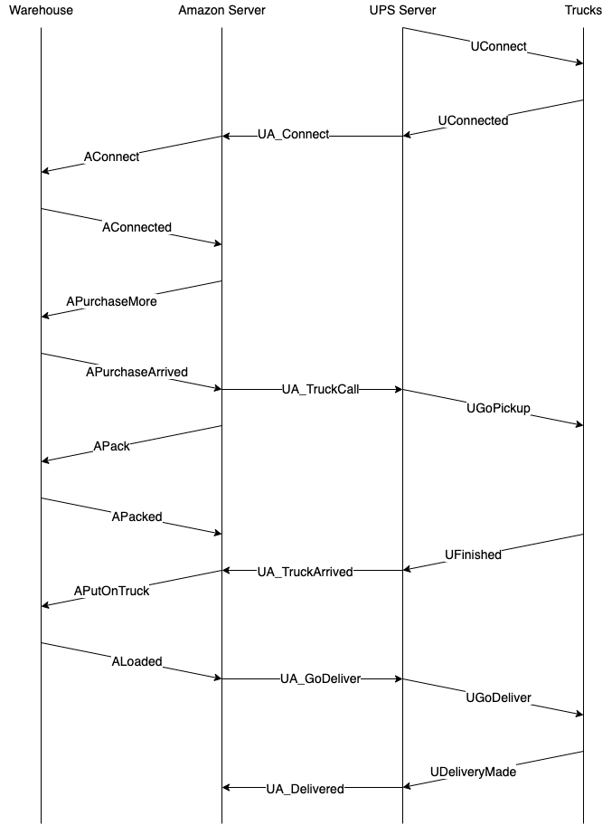

# ERSS Project: Mini-Amazon

By Yijun Mao, Chixiang Zhang

Please refer to the version with the latest finalize commit for grading.

# Usage

To begin with, please make sure both the world simulator and the UPS server are running.

To modify the hostname/port of the UPS server, please change the value of ```ups_server_host``` and ```ups_server_port``` in ```miniamazon/docker-deploy/interface_server/config.py```

To modify the hostname/port or the world simulator, please change the value of ```world_simulator_host``` and ```world_simulator_port``` in ```miniamazon/docker-deploy/interface_server/config.py```.

Then, go to ```miniamazon/docker-deploy/```, and type ```sudo docker-compose up``` to run our amazon app.

If access permission problem happened on ```.sh``` files, please try ```chmod``` on these files.

Please visit ```http://your_host_name:8000/``` to get access to our web app.

Before playing on our web app, please wait a few more seconds for the backend side to initialize. Once the backend side prints the following:

```
[amazon] [INFO] Listen at c01f874b5b13:45678.
[amazon] [INFO] Triggered handle_request process.
[amazon] [INFO] Triggered handle_responses process.
[amazon] [INFO] Triggered recv (AResponses) process.
[amazon] [INFO] Triggered recv (UA_Responses) process.
```

, you are free to operate on our web app.

We only create one warehouse whose address is ```(10, 10)```, which is unchangeable.

Our backend might exit with message ```[amazon] [DEBUG] Stop receiving! Please re-start the backend.``` if it loses connection with the ups server, or the ups server sends illegal message. The program should be restart manually by ```sudo docker-compose up``` if the backend exits.

If ```sudo docker-compose up``` does not work, please try the following steps:

- Create your local PostgreSQL database.

- Open ```miniamazon/docker-deploy/web-app/miniamazon/settings```, change the ```DATABASES``` settings to:

```python
DATABASES = {
    'default': {
        'ENGINE': 'django.db.backends.postgresql',

        'NAME': 'your_database_name',
        'USER': 'your_postgres_username',
        'PASSWORD': 'your_postgres_password',
        'HOST': '127.0.0.1',

        'PORT': '5432',
    }
}
```

- Open ```miniamazon/docker-deploy/interface_server/config.py```, set the following variables:

```python
db_name = 'your_database_name'
db_user = 'your_postgres_username'
db_password = 'your_postgres_password'
db_host = '127.0.0.1'
db_port = '5432'
```

This redirects our ```psycopg2``` mode to your local PostgreSQL database.

- Open ```miniamazon/docker-deploy/web-app/miniamazon_app/wet_app_config.py```, set the following variables:

```python
BACKEND_HOST = socket.gethostname()
BACKEND_PORT = 45678
```
This redirects our backend server's hostname/port to your localhost device. Our backend server need to communicate with the Django web app to obtain the data of orders.

- Make sure the world simulator and the UPS server are running.

- Go to ```miniamazone/interface-server/```, and run ```bash run_backend.sh```.

- Go to ```miniamazon/docker-deploy/web-app/```, and run:

```
python3 manage.py makemigrations
python3 manage.py migrate
python3 manage.py runserver 0:8000
```

If you need to recompile the protobuffer, please go to ```miniamazon/docker-doploy/interface server```, and run ```bash compile_protobuf.sh```.

# Protocols

